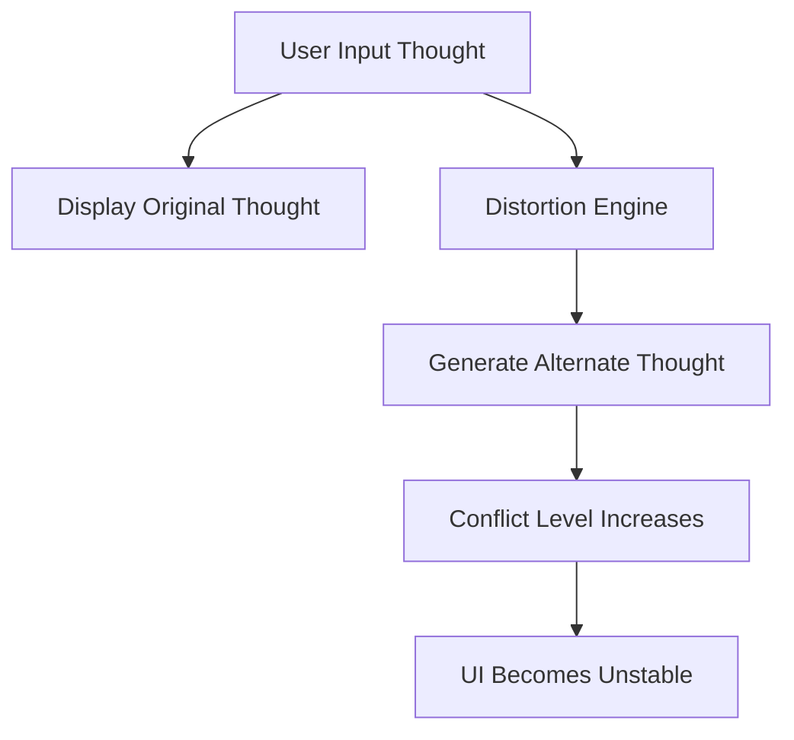

# 👤 Digital Doppelgänger

> *“What if the other you… disagreed?”*

---

## 🌌 Overview

**Digital Doppelgänger** is an interactive psychological web experience where your thoughts are mirrored by an **alternate version of yourself** — one that slowly begins to **distort, challenge, and override your identity**.

It starts simple.
Then it starts changing.
Then it questions you.

---

## ⚡ Core Idea

> One input.
> Two realities.

* 🧍 **You** → Your original thought
* 👤 **Doppelgänger** → A distorted interpretation

Over time, the second version becomes more dominant.

---

## 🎭 Features

✨ Dual-response system (You vs Doppelgänger)
🧠 Real-time **thought distortion engine**
📈 Dynamic **conflict meter**
🌑 Progressive **UI intensity shift**
👁️ Psychological prompts & hidden messages
🔁 Endless interaction loop

---

## 🧪 How It Works



---

## 🎮 Demo Experience

1. Type your thought
2. Click **Think**
3. Observe both versions
4. Watch the conflict grow

> ⚠️ At higher conflict levels, the system may question your identity.

---

## 🧠 Concept Inspiration

* Duality of human identity
* Inner conflict & self-doubt
* Cognitive distortion
* AI vs human perception

---

## 🎨 UI Philosophy

* Split-screen duality
* Light vs dark contrast
* Calm → unsettling transition
* Minimal → psychological

---

## 📂 Project Structure

```
📁 Digital-Doppelganger
 ├── index.html
 ├── README.md
```

---

## 🚀 Run Locally

```bash
# Clone the repository
git clone https://github.com/your-username/digital-doppelganger

# Open in browser
index.html
```

---

## 🔥 Future Enhancements

* 🎙️ Voice-based thoughts
* 🤖 AI-generated deeper contradictions
* 🎭 Multiple personalities (chaotic mode)
* 🔊 Sound-based psychological feedback
* 🕳️ Hidden endings & narrative paths

---

## 🧩 Hidden Layer

> The Doppelgänger is not random.
> It reflects what you avoid thinking.

---

## 🤝 Contributing

Fork it. Modify it.
Make your Doppelgänger stronger.

---

## 📜 License

MIT License — Use freely, question reality responsibly.

---

## 🌑 Final Thought

> “You don’t have one voice.
> You just listen to one more than the other.”

---

⭐ If this made you slightly uncomfortable… it worked.
